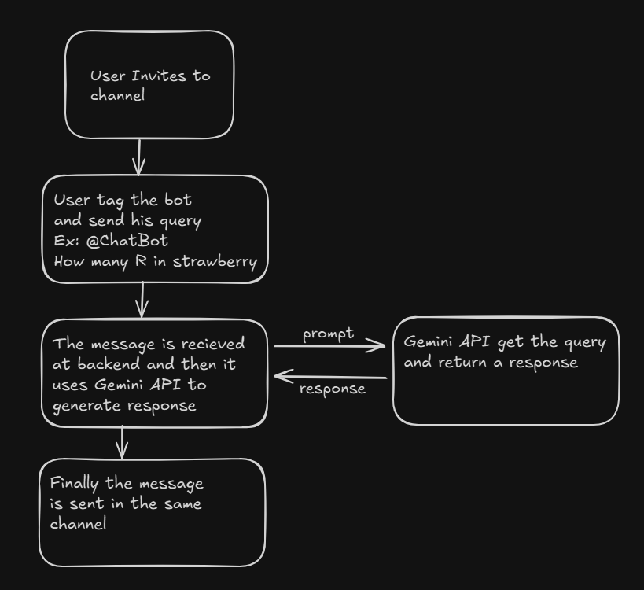

# Slack AI Chatbot using FastAPI & Gemini

This is an AI-powered chatbot for Slack, built using **FastAPI** and **Google's Gemini AI**. It listens to mentions in Slack and responds with AI-generated messages. The bot is deployed for free using **Render**.

# Install the app in your Slack workspace

<a href="https://slack.com/oauth/v2/authorize?client_id=8453330530721.8459493093009&scope=app_mentions:read,im:history,chat:write,commands,channels:read,groups:read,mpim:read&user_scope="></a>

If it doesn't work [click here](https://slack.com/oauth/v2/authorize?client_id=8453330530721.8459493093009&scope=app_mentions:read,im:history,chat:write,commands,channels:read,groups:read,mpim:read&user_scope=)

## 🚀 Features

- 📌 Listens to messages when tagged in Slack.
- 🤖 Generates responses using **Gemini AI**.
- 💬 Maintains short message history for context.
- 🔄 Deployed on **Render** for free hosting.

---

## 🛠️ Tech Stack

- **Backend:** FastAPI
- **AI Model:** Google's Gemini API
- **Deployment:** Render
- **Slack SDK:** `slack_sdk`
- **Python Dependencies:** `fastapi`, `pydantic`, `uvicorn`, `slack_sdk`, `google.generativeai`, `python-dotenv`, `pymongo`

---

## 🔧 Installation & Setup

### 1️⃣ Clone the Repository

```bash
 git clone https://github.com/lakhwan/slack-bot.git
 cd slack-bot
```

### 2️⃣ Create a Virtual Environment

```bash
python -m venv venv
source venv/bin/activate  # For Linux/macOS
venv\Scripts\activate     # For Windows
```

### 3️⃣ Install Dependencies

```bash
pip install -r requirements.txt
```

### 4️⃣ Set Up Environment Variables

Create a **.env** file in the root directory and add:

```env
SLACK_CLIENT_SECRET=your-slack-signing-secret
SLACK_CLIENT_ID=your-slack-client-id
GEMINI_API_KEY=your-gemini-api-key
MONGO_URI=your-mongodb-uri
```

### 5️⃣ Run the FastAPI Server Locally

```bash
uvicorn main:app --reload
```

---

## 🔥 Usage

1. Invite the bot to a Slack channel.
2. Mention the bot (`@ChatBot`) and send a message.
3. The bot will reply using Gemini AI!

---

## 🎥 Demo Video

📌 **[Click here](https://drive.google.com/file/d/1BXDomOZuNjcLoovWXIPCflXtzeL2mXtR/view?usp=sharing)** to watch the bot in action!

---

## 📷 Backend Architecture



## 📜 License

This project is licensed under the **MIT License**.

---

💙 Made with love by **Upender Singh Lakhwan** 🚀
